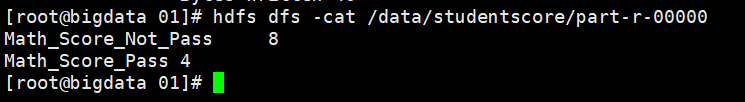

# hadoop-training
一个大数据的例子-Hadoop实现 （简书链接：https://www.jianshu.com/p/8d9efad41053）

## 数据
### 原始数据

### 数据说明
    数据按照逗号（,）分割，每列数据说明如下：
    

| 序号 | 说明 | 备注 |
| --- | --- | --- |
| 1 | 学号 |  |
| 2 | 姓名 |  |
| 3 | 性别 |  |
| 4 | 年龄 |  |
| 5 | 上学期成绩 | 学科成绩以&分割，学科=成绩 |
| 6 | 下学期成绩 | 学科成绩以&分割，学科=成绩 |

## 需求
    统计第一学期数学成绩及格和不及格的人数
    
## 解决方案
    数据结构相对比较简单，分析每行数据中的第一学期数学成绩，判断其中数据成绩是否及格，如果及格，则统计及格的人数，不及格统计不及格的人数。
## 1.使用MapReduce解决

MapReduce的思路就是将所需要进行计算的数据，拆分到不同的机器上，然后再不同的机器上计算，将不同机器上的结果汇总到一起，然后再进行计算。再不同机器上进行计算的过程，通常称为Map阶段，汇总结果进行计算的过程，通常称为Reduce阶段。

    结合MapReduce计算的基本思路:MapReduce实现一个任务主要分为Map和reduce两部分。
    在实现的过程中，主要完成Map和Reduce的实现过程即可。
    当然，一个MapReduce的任务，必须要有一个驱动主类将Map和Reduce调起方能执行。
 
#### 1.1 Map
新建StudentScoreMapper，需要继承org.apache.hadoop.mapreduce.Mapper，并指定Map的输入输出类型，共有四个参数，前两个为输入数据类型，后两个为输出数据类型
```
    public class StudentScoreMapper extends Mapper<Object,Text, Text, IntWritable>
```
Map阶段具体的执行逻辑时再map方法中实现的，故需要重写父类的Map方法，具体思路：

1. 获取第一学期的成绩
2. 获取该学期的数据成绩
3. 判断数学成绩是否及格，如果及格，则使用输出<"Math_Score_Pass"，1>，否则输出<"Math_Score_Not_Pass",1>

```
@Override
protected void map(Object key, Text value, Context context) throws IOException, InterruptedException {   
    // 1. valueIn为文件中每行的数据,使用split方法进行分割    
    String[] vals = value.toString().split(",",-1);    
    // 2.每行数据中，倒数第二列为第一学期成绩    
    if(vals.length !=6 ){return;}   
    String scoreStr = vals[5];    
    // 3.每门成绩按照&分割    
    String[] scores = scoreStr.split("&");    
    if(scores.length != 4){return;}    
    // 4.获取数学成绩,学科成绩按照=分割    
    String mathScoreStr = scores[0];    
    String[] mathScore = mathScoreStr.split("=");    
    if(mathScore.length != 2){return;}    
    String score = mathScore[1];    
    // 5.判断成绩是否及格    int temp = Integer.parseInt(score);    
    if(temp >= 60){        
        context.write(outKeyPass,new IntWritable(1));    
    }else{        
        context.write(outKeyNotPass,new IntWritable(1));    
    }
}
```


#### 1.2 Reduce
新建StudentScoreReducer类，继承org.apache.hadoop.mapreduce.Reducer，同时指定Reduce的输入和输出类型，其中输入类型与Map的输出类型保持一致。

```
public class StudentScoreReducer extends Reducer<Text, IntWritable,Text, LongWritable>
```
Reduce阶段具体的处理逻辑需要重写reduce方法，具体思路：就是把Map的输出结果，累加即可。
```
protected void reduce(Text key, Iterable<IntWritable> values, Context context) throws IOException, 
InterruptedException {    
    //1.经过shuffle之后 相同key的结果value 组成一个Iterable，作为reduce的输入参数进行计算    
    //2.遍历Iterable，将期所有的val进行累加    
    long sum = 0L;    
    for(IntWritable val : values){
        sum += val.get();    
    }   
    //3.返回计算结果    
    context.write(key,new LongWritable(sum));
}
```
 #### 1.3 驱动类
针对MapReduce的任务进行一些配置，设置Map类、Reduce类，任务输入输出路径等相关信息。

```
public static void main(String[] args) throws 
IOException, ClassNotFoundException, InterruptedException {
    Configuration conf = new Configuration();
    Job job = Job.getInstance(conf);
    //设置任务的名称
    job.setJobName("StudentScoreCount");
    //设置任务执行的主类
    job.setJarByClass(StudentScoreMain.class);
    //设置reduce任务的个数
    job.setNumReduceTasks(1);
    //设置Map类
    job.setMapperClass(StudentScoreMapper.class);
    //设置combiner，在Map端执行reduce任务
    //job.setCombinerClass(StudentScoreReducer.class);
    //设置Reduce类
    job.setReducerClass(StudentScoreReducer.class);
    //设置输出key的类
    job.setOutputKeyClass(Text.class);
    //设置输出value的类
    job.setOutputValueClass(LongWritable.class);
    //如果Map和Reduce的输出类型不一致，需要单独对map设置输出key和value的类型
    //同时注释setCombinerClass方法
    job.setMapOutputKeyClass(Text.class);
    job.setMapOutputValueClass(IntWritable.class);

    //设置Map输入路径
    FileInputFormat.addInputPath(job, new Path(args[0]));
    //设置Reduce输处路径
    FileOutputFormat.setOutputPath(job, new Path(args[1]));    
    System.exit(job.waitForCompletion(true) ? 0 : 1);
}

```
#### 1.4 执行
将编写的代码进行打包，发送到hadoop的集群，提交MapReduce任务
```
hadoop jar hadoop-training-1.0-SNAPSHOT.jar \
com.hadoop.mapreduce.StudentScoreMain \
/data/student /data/studentscore/
```
其中，/data/student为任务所需要处理的路径，/data/studentscore/ 为最终结果输出路径，需要保证这个文件在HDFS上不存在。

查看输出文件夹下的文件，其中，以part开始的文件为最终的数据结果


查看任务执行结果



查看任务的基本信息，执行实践为20sec
